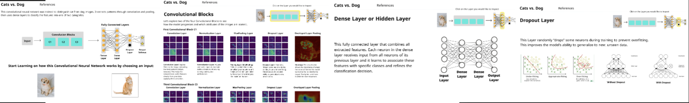
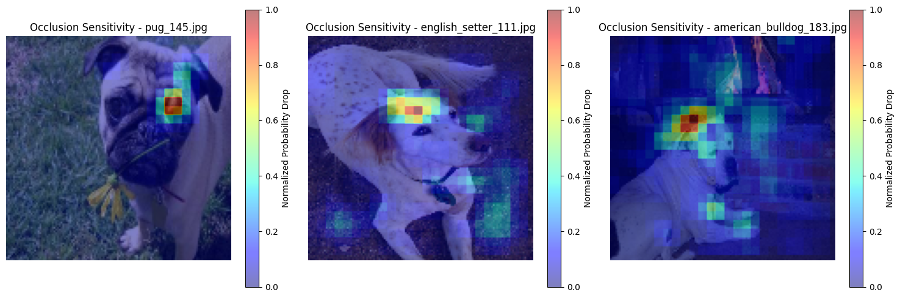
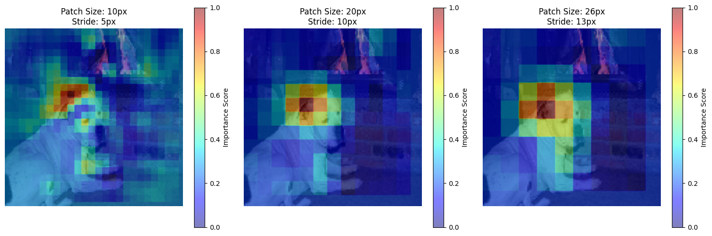
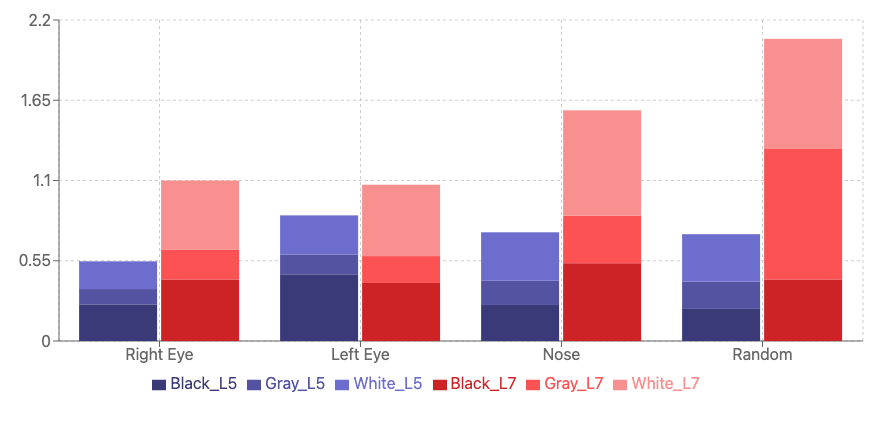
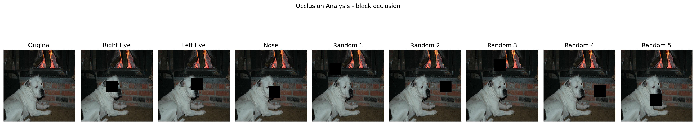
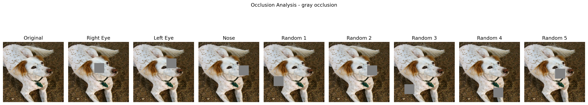
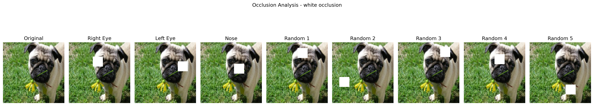

# AI and VISUALIZATION

Exercise with two team projects:

-------------------

-------------------

[](https://classroom.github.com/a/-VohRijK)

# Explainable AI Assignment 1: Projection Space Exploration
In this assignment, you are challenged to analyze and compare solutions of a problem, game, algorithm, model, or anything else that can be represented by sequential states. For this, you will project the high-dimensional states to the two-dimensional space, connect the states, and add meta-data to the visualization.

Exemplary solutions are provided in the `solution_rubik.ipynb` and `solution_2048.ipynb` notebooks. 

Further examples to analyze are (board) games and approximation algorithms. The 2048 notebook uses [OpenAI Gym](https://gym.openai.com/) to create a game environment and produce state data. There is a variety of first and third party environments for Gym that can be used.

## General Information Submission

For the intermediate submission, please enter the group and dataset information. Coding is not yet necessary.

**Group Members**

| Student ID | First Name | Last Name | E-Mail                    | Workload [%] |
| ----------|------------|-----------|---------------------------|--------------|
| K12140156 | Jaroslav   | Kvasnicka | K12140156@students.jku.at | 25           |
| K01611130 | Severin    | Lechner   | k01611130@students.jku.at | 25           |
| K11929354 | Stepan     | Malysh    | K11929354@students.jku.at | 25           |
| K01119156 | Manuel     | Bichler   | K01119156@students.jku.at | 25           |

### Dataset
Please add your dataset to the repository (or provide a link if it is too large) and answer the following questions about it:

* Which dataset are you using? What is it about?
 
  We are using our own dataset, which is about the game of Tic-Tac-Toe, but taking the first moves from the real world. We found some data on first moves of 200 people on Reddit where a person shared the results collected over a week by playing Tic-Tac-Toe with family, neighbors, colleagues, and friends, capturing a range of choices from participants aged 9 to 67. Each row of our generated dataset represents a state of the game board during a simulated game, including the positions of the pieces and the player's move. 
* Where did you get this dataset from (i.e., source of the dataset)? How was the dataset generated?

  We calculated the probability distribution for each possible first move by Player X using a dataset of observed moves, allowing us to simulate X's first move based on these probabilities. For Player O's response, we conditioned the choice on X's initial move, creating a probability-adjusted response for O’s first turn. We created the dataset ourselves using a Python script that simulates random games of Tic-Tac-Toe. The script records each move, the state of the board at each step, and the outcome of the game (win/loss/draw). You can find the script in `/data/tic_tac_toe/tic_tac_toe.py`. 

PROVIDE THE UPDATED LINKS
  
* What is dataset size in terms of nodes, items, rows, columns, ...?

  The dataset consists of approximately 10,000 simulated games. Each game generates multiple rows of data, one for each move. Each row contains 13 columns: 9 columns for the board positions (pos00 to pos22), 1 column for the current player, 1 column for the step number (move order), 1 column for the game result (win/loss/draw) and one column indicating the state of the game (start/mid/end).
  
* What do you want to analyze?

  We want to analyze patterns and strategies of Tic-Tac-Toe game, specifically focusing on the starting moves made by players and how these moves influence the game's outcome (win, loss, or draw). Through the generated dataset of simulated games, we can observe which starting moves are most commonly selected, identify successful sequences of moves, and evaluate whether certain strategies consistently lead to winnings or draws.
  
* What are you expecting to see?

  Firstly, which starting positions are played more often and which responses are played more often. Secondly, we will pay attention if any optimal or preferred strategies exist which lead more often to the win. Finally, we will study if there are any defensive strategies that consistenly lead to draw. Furthermore we hope to see some Outcome/Game state clusters.

TODO

## Final Submission

* Make sure that you pushed your GitHub repository and not just committed it locally.
* Sending us an email with the code is not necessary.
* Update the *environment.yml* file if you need additional libraries, otherwise the code is not executeable.
* Create a single, clearly named notebook with your solution, e.g. solution.ipynb.
* Save your final executed notebook as html (File > Download as > HTML) and add them to your repository.

## Drive and Video:
https://drive.google.com/drive/folders/1iyFMa5rZz5LmxD2QpnXDyt-3MvLnBp42?usp=sharing

## Development Environment

Checkout this repo and change into the folder:
```
git clone https://github.com/jku-icg-classroom/xai_proj_space_2024-<GROUP_NAME>.git
cd xai_proj_space_2024-<GROUP_NAME>
```

Load the conda environment from the shared `environment.yml` file:
```
conda env create -f environment.yml
conda activate xai_proj_space
```

> Hint: For more information on Anaconda and enviroments take a look at the README in our [tutorial repository](https://github.com/JKU-ICG/python-visualization-tutorial).

Then launch Jupyter Lab:
```
jupyter lab
```

Go to http://localhost:8888/ and open the *template* notebook.

Alternatively, you can also work with [binder](https://mybinder.org/), [deepnote](https://deepnote.com/), [colab](https://colab.research.google.com/), or any other service as long as the notebook runs in the standard Jupyter environment.


------------------------

------------------------


[](https://classroom.github.com/a/osI6zUIF)

# Explainable AI Assignment 2 - Model Explanations
In this assignment, you are challenged to explain a model. For this, you will research exisiting approaches and apply them to your model and interpret the results.

## General Information Submission

For the intermediate submission, please enter the group and dataset information. Coding is not yet necessary.

**Team Name:** grasshoppers

**Group Members**

| Student ID | First Name | Last Name | E-Mail                   |  Workload [%]    |
| ----------|------------|-----------|---------------------------|------------------|
| K12140156 | Jaroslav   | Kvasnicka | K12140156@students.jku.at | 25%              |
| K01611130 | Severin    | Lechner   | k01611130@students.jku.at | 25%              |
| K11929354 | Stepan     | Malysh    | K11929354@students.jku.at | 25%              |
| K01119156 | Manuel     | Bichler   | K01119156@students.jku.at | 25%              |

### Start of Intermediate Submission

# Cat vs Dog Image Classification using CNNs

In this project, we are explaining how a convolutional neural network (CNN) classifies images of cats and dogs. The model automatically learns hierarchical feature representations from input images, enabling it to recognize patterns and classify images accurately. It takes an image of either a cat or a dog as input and outputs a label: `1` for dog or `0` for cat. 

The data used contains about 12,000 labeled images of each (cats and dogs) in various formats.

---

### Datasource 
The model and data were obtained from [Kaggle](https://www.kaggle.com) under the dataset: [Dogs vs Cats](https://www.kaggle.com/c/dogs-vs-cats). 

This training archive contains 25,000 images of dogs and cats, sourced from:
- **Microsoft Cats vs Dogs Dataset**
- **Stanford Dog Dataset**

Originally, these images were provided to Microsoft Research by [Petfinder.com](https://www.petfinder.com), the world's largest site devoted to finding homes for homeless pets.

---

## Model Description

The architecture of the Cat vs Dog Image Classification model consists of the following layers:

- **Input Layer**: A `Conv2D` layer with 32 filters and ReLU activation.
- **Convolution Blocks**: 
  - 4 convolution blocks with increasing filters (e.g., 32, 64, 128) and ReLU activation.
  - Each block includes:
    - **Batch Normalization**
    - **Max Pooling** (`pool_size=2`)
    - **Dropout** (`rate=0.2`)
- **Fully Connected Layers**:
  - **Flatten Layer**
  - **Dense Layer** with 512 units
  - **Dropout Layer**
- **Output Layer**: A `Dense` layer with 2 units and softmax activation.

---

## Explainability Approaches

To better understand the CNN model's behavior, we selected the following explainability techniques:

1. **Layer-wise Activation Visualization**:  
   Observes the progression of feature detection through the network's layers, illustrating how simple features combine into complex patterns.

2. **Saliency Maps**:  
   Identifies the most influential regions in input images, highlighting areas the model considers important for classification.

3. **Dimensionality Reduction (t-SNE)**:  
   Visualizes the internal feature space of the model, revealing how it separates and organizes cat and dog images.

4. **Adversarial Examples**:  
   Assesses the model's robustness by analyzing how slight changes to input images affect predictions.

---

## Expected Outcomes

By applying these explainability approaches, we aim to:

- Enhance understanding of the model's internal workings.
- Identify key features and patterns the model uses for classification.
- Gain insights into the model's strengths and potential weaknesses.
- Provide an interactive experience for users to engage with the model's processes.

---

## Research Questions

The project seeks to answer the following research questions:

1. How does the CNN internally represent features that distinguish cats from dogs at each layer?
2. Which regions of the input images are most influential in the model's classification decisions?
3. How does the model organize and separate cat and dog images in its internal feature space?
4. How does occluding different regions of input images affect the model's predictions, and what does this reveal about which image features the model relies on for classification?

### End of Intermediate Submission

# Explainability Approaches 

### Target Persona of our Approaches: 

AI Enthusiast who wants to dive deeper
Name: Alex Carter  Age: 35
Background: technology enthusiast and digital marketer, no formal training in AI or programming, follows AI-related blogs, YouTube tutorials, and demos, he writes his own blog

### Goal Visualizations: Teaching and Understanding Concepts and Image areas of Interest
1. Educate about basic concepts and use the visualizations to see how neural networks in image classification work
2. Understand what a neural network thinks is important in an image
3. Understand potential weaknesses of the models when learning areas of interest

### Three different approaches: 
To educate about basic concepts and use visualizations to explain neural networks in image classification we use an

**1. Interactive Network Visualization App**

This app contains multiple methods of visualization such as 
After gaining a first understanding of CNNs via the App, the user is guided author-driven through different ways of understanding important image areas and potential pitfalls of the CNN, starting with an

**2. Occlusion Sensitivity Analysis**

This approach uses Occlusion Sensitivity Map, written explanations and 2D stacked bar charts, to understand what an neural network thinks is important in an image and explore potential weaknesses in models. 
Furthermore this is compared to another method of exploring and visualizing the areas crucial for prediction: 

**3.Lime Analysis**

This second analysis, also using heat map - style image maps to mark zones of interest helps to identify errors, verify results and compare methods visually to the previous results.

# [Interactive Network Visualization App](https://www.figma.com/proto/jSr6gSc9NbPHnQbn6OmyHz/CNN?node-id=307-236&node-type=frame&t=adyUsfZCEEqPLl7m-1&scaling=contain&content-scaling=fixed&page-id=0%3A1)



Try it out by clicking the title link or alternatively watch the [demo here](https://drive.google.com/file/d/19zLND2iCiSGr1TX8LqmdLVinthPf9KhU/view?usp=sharing)

### Classification According to Hohman et al.
- **WHY**: Teaching and Understanding the Basic Concepts of the model and each layer
- **WHO**: AI enthusiast, such as our target persona and interested stakeholders who want to understand what the models sees and want more information on its different layers
- **WHAT**: Network Architecture, Learned model Parameters/ what the model sees at different stages, Concepts of the Model’s components
- **HOW**:
    - High level Overview 
    - Every conceptual layer on its own: 
      - Convolutional Block: Images of the processed data per layer (Convolution, Normalization, MaxPool, Dropout) Heatmap visualization, and a ReLU activation graph from an online resource 
      - Flatten Layer: Example; pooled feature map → flattend vector from an online resource 
      - Dense Layer: Nodes and edges to visualize a network architecture from an online resource 
      - Dropout Layer: Nodes and edges to visualize a network architecture with and without dropout to compare them, from an online resource; 2D graphs showing under to overfitted data from an online resource 
      - Output Softmax: Written explanation as well as formula
  - Interactive Design: Martini Glas structure; Drill Down Story
  - References (for more details on each)
- **WHEN**: Post-training analysis (requires only a trained model and input images)
- **WHERE**: General explanations (focusing on how the parts of a network process the image and arrive specific predictions) 

### Result 
The resulting Mockup App provides enough functionality to enable interested stakeholders to dive into the different components of the model, layer by layer and see visually how the input he/she choose is affected/processed by the model. Even though the the explanation of most concepts is held simple, a general understanding of how CNNs predict image classes is obtained. Especially successful and insightful are the layerwise visualizations of the Convolutional Block. Here the Heat-Maps showing the areas of interest also give a starting point to dive deeper into the exploring which regions are most important for a CNN's classifications.

# Occlusion Sensitivity Analysis for Dog Breed Classification

## Approach Overview

Our occlusion sensitivity analysis is based on techniques introduced by Zeiler and Fergus in their influential paper "Visualizing and Understanding Convolutional Networks" (2014). In their work, they demonstrated how systematically occluding portions of input images can reveal which regions are most important for a CNN's classifications. We adapted this technique to understand our dog breed classifier's decision-making process.

## Implementation

We conducted two complementary experiments:

1. **Basic Occlusion Analysis** (`occlusion_sensitivity.ipynb`):
   - Initial implementation with 10x10 pixel patches revealed an interesting challenge: using small patches (10px) highlighted important features outside the actual dog regions
   - Through experimentation with various patch sizes, we found that larger patches (20-26px) were more effective at highlighting semantically meaningful features like ears and facial characteristics
   - 5-pixel stride for comprehensive coverage
   - Generated sensitivity heatmaps showing prediction changes

2. **Extended Color Analysis** (`color_analysis.ipynb`):
   - Three different occlusion colors (black, gray, white)
   - Gray patches were used in the original "Visualizing and Understanding Convolutional Networks" paper by Zeiler and Fergus. We expanded on this by also using black and white patches to probe the model's response to different levels of contrast and intensity. Gray patches serve as a neutral baseline, while black and white represent the extremes of the color spectrum.
   - Fixed locations (eyes, nose) and random positions
   - Analysis at two network depths (Layer 5 and Layer 7)

## Classification According to Hohman et al.

- **WHY**: Model debugging and interpretation (Understanding which regions in an image influence the model's predictions most strongly)

- **WHO**: Model developers and stakeholders who need to understand what visual features the model uses for classification

- **WHAT**: 
  - Data Type: Image data
  - Algorithm Type: Post-hoc model analysis
  - Visualization Type: Overlay heatmaps showing sensitivity regions

- **HOW**: Instance-based visual explanation through perturbation analysis (systematically blocking parts of the input)

- **WHEN**: Post-training analysis (requires only a trained model and input images)

- **WHERE**: Local explanations (focusing on how individual parts of an image affect specific predictions)

## Key Findings

### 1. Unexpected Background Reliance

In our initial heatmap analysis, we discovered a concerning behavior:



The American bulldog image (right) revealed significant model sensitivity to the area above the dog's head - a region containing no dog features. This suggests the model might be using background context rather than just dog-specific features for classification.

### 2. Patch Size Impact on Feature Detection



During our initial implementation, we discovered an important methodological insight regarding patch size selection. When using fine-grained patches (10px on 128x128 images), our sensitivity analysis highlighted areas outside the dog as important for classification. However, increasing the patch size to 20-26px revealed more semantically meaningful features, particularly anatomical features like ears and facial structures. This suggests our model's decision-making process relies more heavily on larger anatomical features rather than fine textures or small details - an observation that aligns with how human experts typically identify dogs. This finding not only helped us optimize our visualization method but also provided valuable insights into how our model processes visual information. Our findings align with Brendel and Bethge (2019) "Approximating CNNs with Bag-of-local-Features models works surprisingly well on ImageNet," who demonstrated that CNNs tend to rely on larger features rather than fine-grained details. Similarly, Geirhos et al. (2019) "ImageNet-trained CNNs are biased towards texture; increasing shape bias improves accuracy and robustness" found that standard CNNs show a preference for processing larger shape features over local textures.

### 3. Complex Layer-Specific Color Responses

Our detailed analysis of different occlusion colors across network layers revealed intriguing patterns in how our model processes visual information:

#### Table 1: Sensitivity Measures Across Network Layers

| Color | Location  | Layer 5       | Layer 7       |
| ----- | --------- | ------------- | ------------- |
| Black | Right Eye | 0.251 ± 0.038 | 0.422 ± 0.117 |
| Black | Left Eye  | 0.457 ± 0.395 | 0.398 ± 0.027 |
| Black | Nose      | 0.247 ± 0.112 | 0.533 ± 0.275 |
| Black | Random    | 0.220 ± 0.019 | 0.422 ± 0.052 |
| Gray  | Right Eye | 0.105 ± 0.026 | 0.205 ± 0.073 |
| Gray  | Left Eye  | 0.136 ± 0.030 | 0.184 ± 0.014 |
| Gray  | Nose      | 0.166 ± 0.038 | 0.325 ± 0.020 |
| Gray  | Random    | 0.187 ± 0.091 | 0.894 ± 0.978 |
| White | Right Eye | 0.190 ± 0.096 | 0.473 ± 0.344 |
| White | Left Eye  | 0.268 ± 0.050 | 0.489 ± 0.095 |
| White | Nose      | 0.332 ± 0.010 | 0.723 ± 0.144 |
| White | Random    | 0.325 ± 0.093 | 0.755 ± 0.452 |



The bar chart visualizes the sensitivity measures for different occlusion colors (black, gray, white) at two network layers (Layer 5 and Layer 7) across four locations (right eye, left eye, nose, random).
Key interpretations:

1. The gray occlusion at Layer 7 for the random location shows the highest sensitivity score (around 0.9), significantly higher than all other combinations. This suggests that the deeper layer (L7) is highly sensitive to even subtle, randomly placed occlusions.
2. Overall, Layer 7 (red/pink bars) shows higher sensitivity scores compared to Layer 5 (blue bars) for most color-location combinations. This indicates that the deeper layer has more complex and potentially less stable feature processing.
3. For targeted occlusions on key features like eyes and nose, white patches generally cause higher sensitivity than black or gray, especially at Layer 7. This could mean the model is more disrupted by high-contrast occlusions on important features.
4. Sensitivity to random location occlusions is generally higher than targeted eye/nose occlusions (except the gray-L7 outlier). This implies the model is reactive to occlusions across the image, not just on key dog features.

In summary, the bar chart highlights the model's heightened sensitivity in deeper layers, particularly to subtle random occlusions, as well as its complex responses to occlusion color and location. These findings raise questions about the stability and robustness of the model's learned features, especially in the deeper layers.

## Visual Examples

The progression of our analysis can be seen in these examples:

Examples of different occlusion types:




This layer-specific behavior suggests our model develops increasingly complex but potentially less stable feature processing in deeper layers. Particularly noteworthy is the unexpected high sensitivity to gray occlusions in random locations at Layer 7. While one might expect extreme values (black/white) to cause more disruption, gray (neutral color) occlusions led to the largest sensitivity scores. This unexpected behavior raises potential concerns:

1. **Model Stability**: The high variance in Layer 7's response to gray patches (±0.978) suggests the layer might be overly sensitive to subtle changes in the input.
2. **Feature Processing**: This instability in deeper layers might explain why the model sometimes relies on background features, as seen in our heatmap analysis.
3. **Robustness Concerns**: Such high sensitivity to neutral occlusions could indicate that the model might behave unpredictably when processing new images in real-world scenarios.

## Implications

### Model Reliability Concerns

1. **Background Dependency**:
   - The model appears to use non-dog features for classification
   - This could lead to misclassifications when dogs appear in unfamiliar contexts
   - Suggests potential dataset biases in how breeds are photographed
   - The model's reliance on larger anatomical features (as revealed by patch size analysis) suggests a need for multi-scale feature processing capabilities

   This background reliance phenomenon was similarly observed by Ribeiro et al. (2016) "Why Should I Trust You?: Explaining the Predictions of Any Classifier" and Lapuschkin et al. (2019) "Unmasking Clever Hans Predictors and Assessing What Machines Really Learn," who found cases where models relied on contextual features rather than the intended subject.

2. **Layer Processing Instability**:
   - The high variance in Layer 7 responses (especially to gray occlusions)
   - More complex but potentially less reliable feature processing in deeper layers
   - Questions about the robustness of learned features

   This behavior echoes findings from Ghorbani et al. (2019) "Interpretation of Neural Networks is Fragile," who demonstrated that deeper layers in CNNs can be particularly sensitive to small perturbations. Additionally, Sundararajan et al. (2017) "Axiomatic Attribution for Deep Networks" discussed how attribution methods can reveal unstable feature processing in deeper network layers.

## Recommendations for Improvement

Based on our findings, we suggest:

1. **Training Data Improvements**:
   - Diversify background contexts for each breed
   - Implement background augmentation during training
   - Consider attention mechanisms to focus on dog features

2. **Architecture Considerations**:
   - Investigate the stability of deeper layer processing
   - Consider adding constraints to focus on dog-specific features
   - Evaluate the need for additional regularization in deeper layers
   - Implement multi-scale analysis techniques to capture both fine-grained and larger anatomical features effectively

## Conclusion

Our occlusion sensitivity analysis revealed three critical insights about the model's behavior: its reliance on background features, its preference for larger anatomical features over fine details, and complex, potentially unstable processing in deeper layers. These findings highlight important areas for improvement in the model's architecture and training process, contributing to the broader goal of creating more reliable and interpretable dog breed classifiers.


## References

- M. D. Zeiler and R. Fergus, "Visualizing and Understanding Convolutional Networks," Proceedings of the European Conference on Computer Vision (ECCV), 2014.
- W. Brendel and M. Bethge, "Approximating CNNs with Bag-of-local-Features models works surprisingly well on ImageNet," arXiv preprint arXiv:1904.00760, 2019.
- R. Geirhos, P. Rubisch, C. Michaelis, M. Bethge, F. A. Wichmann, and W. Brendel, "ImageNet-trained CNNs are biased towards texture; increasing shape bias improves accuracy and robustness," arXiv preprint arXiv:1811.12231, 2018.
- A. Ghorbani, A. Abid, and J. Zou, "Interpretation of Neural Networks is Fragile," arXiv preprint arXiv:1710.10547, 2017.
- M. Sundararajan, A. Taly, and Q. Yan, "Axiomatic Attribution for Deep Networks," arXiv preprint arXiv:1703.01365, 2017.
- M. T. Ribeiro, S. Singh, and C. Guestrin, "'Why Should I Trust You?': Explaining the Predictions of Any Classifier," arXiv preprint arXiv:1602.04938, 2016.
- S. Lapuschkin, S. Wäldchen, A. Binder, G. Montavon, W. Samek, and K.-R. Müller, "Unmasking Clever Hans Predictors and Assessing What Machines Really Learn," arXiv preprint arXiv:1902.10178, 2019.

# LIME for Cat/Dog Classification
# Local Interpretable Model-agnostic Explanations (LIME) for Cat/Dog Classification

### Classification According to Hohman et al.
- **WHY**: Model debugging and interpretation (Understanding which regions in an image influence the model's predictions most strongly)
- **WHO**: Model developers and stakeholders who need to understand what visual features the model uses for classification
- **WHAT**:
  - **Data Type**: Image data
  - **Algorithm Type**: Post-hoc model analysis
  - **Visualization Type**: Overlay heatmaps showing sensitive regions that impact the model's predictions
- **HOW**: Instance-based visual explanation through perturbation analysis (systematically altering parts of the input image and observing how these changes affect the model's predictions)
- **WHEN**: Post-training analysis (requires only a trained model and input images for explanation)
- **WHERE**: Local explanations (focusing on how specific parts of an image influence individual predictions)


### Choice of Parameters
1. **Top Labels (1 vs. 2)**:
   - We used top_labels=2 to analyze the primary and secondary predictions made by the model.
   - Considering two top labels allowed us to understand not just the most confident prediction (cat or dog) but also the second-best guess. This is especially helpful in misclassified cases or images with ambiguous features.
   - Using only one label (top_labels=1) would limit the analysis to a single perspective, potentially missing insights about borderline decisions.

2. **Number of Samples**:
   - **10,000 samples** were used to create perturbed versions of each image.
   - Though experimentation and trying multiple different amounts it was found that there isn't much contirubution by increasing the amount of images sent to the classification function. 
   - While less pixels provided noesier results.
3. **Number of Features**:
   - For positive contributions, we visualized **5 superpixels** to emphasize the most critical regions.
   - For combined positive and negative contributions, **10 superpixels** were chosen to provide a more comprehensive view of the key visual features.

4. **Choice of Examples**
    - Since we didnt focus on a single picture we parameters were applied to sample so we didnt focus on optimising the method for each picture particularly which differ a lot because of the nature of the dataset, so out of the samples we tried to focus on the ones to which the chosen parameters were applied successfully. 
### Results with different top_labels. 

We applied the LIME method over the random sample of correctly classified images with different top_labels. Since setting the top_labels to 1 focuses on understating the features driving the top class decision (since it is certain about its classification), and top_label = 2 considers both options and can provide insights over borderlines. 

#### These are some examples with top_label set to 1: 


#### And the same pictures with top_label set to 2: 


As we can see the difference varies over the pictures and maybe if it doesnt significantly change the output but in some cases can be more useful. 

### Some particular examples.


### Results with incorrectly classified images. 

We also applied the method over incorrectly classified images. 


### Conclusion 
 - The visual explanations showed that the model can probably focuse on certain parts of the image, like ears and "facial" features of an object, when deciding whether an image is a cat or a dog. 
 - Misclassified images are potentially connected to overlapping features (e.g., similar-looking regions in both cats and dogs, like ears or fur). This shows that the model's performance could be further improved by focusing on areas with less discriminative features or by increasing the diversity of the dataset to reduce overlap in these regions.


### References
- Marco Tulio Ribeiro, "Tutorial - Images - Pytorch," LIME Documentation, [LIME GitHub Repository](https://github.com/marcotcr/lime/tree/master).
- Marco Tulio Ribeiro, Sameer Singh, and Carlos Guestrin, "Why Should I Trust You? Explaining the Predictions of Any Classifier," Proceedings of the 22nd ACM SIGKDD International Conference on Knowledge Discovery and Data Mining, 2016, pp. 1135–1144.

## Summary of Approaches
To summarize we are convinced that the combination of an interactive, martini-glass shaped app to forster basic understanding of model concepts and components, together with two deeper, more complex analysis of image area importance, which enables the target audience to understand what a neural network "thinks" is important and what potential pitfalls are in an image. Using a second, similar visual analysis of zones of interest in images helps to consolidate learnings, identify errors, verify results and compare methods visually to the previous results.

## Presentation [Link](https://drive.google.com/file/d/1NBNHFEONf5mR349dxdDgMeqUeCSFiPSI/view?usp=drive_link)
**PDF of the Presentation** [here](https://drive.google.com/file/d/18EyddPCN2CElHjFE6pvSxf-v4blSB_IB/view?usp=drive_link)

